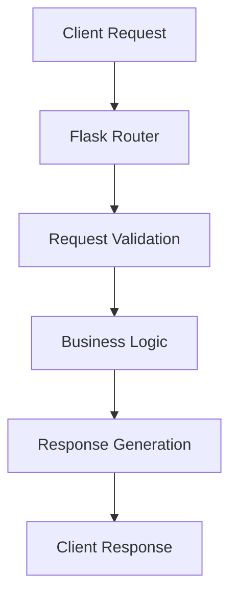
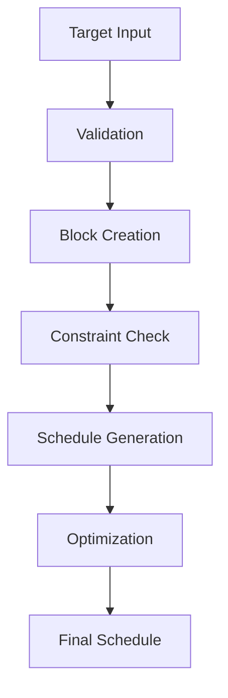

# System Architecture

## Component Overview

### 1. Frontend Layer

- **Web Interface**
  - HTML5/CSS3/JavaScript
  - Bootstrap 5.1.3
  - jQuery 3.6.0
  - Dynamic updates
  - Interactive visualizations

### 2. Backend Layer

- **Flask Application**
  - REST API endpoints
  - Request handling
  - Response generation
  - Error management

### 3. Processing Layer

- **Scheduler Engine**
  - Priority-based scheduling
  - Time allocation
  - Optimization

### 4. Visualization Layer

- **Plot Generation**
  - Schedule timelines
  - Sky position maps
  - Airmass calculations
  - Priority visualization

## Data Flow

### 1. Request Handling



### 2. Scheduling Flow



## Component Interaction

### 1. API Layer

```python
@app.route('/add_target', methods=['POST'])
def add_target():
    """Target addition endpoint"""
    data = request.json
    # Validation & Processing
    return jsonify(response)
```

### 2. Scheduler Layer

```python
class SimpleScheduler:
    """Schedule generation and optimization"""
    def __init__(self, observer, constraints):
        self.observer = observer
        self.constraints = constraints
```

### 3. Visualization Layer

```python
def generate_plots():
    """Plot generation system"""
    plots = {
        'schedule': create_schedule_plot(),
        'sky': create_sky_plot(),
        'airmass': create_airmass_plot()
    }
```

## Directory Structure

```
DND/
├── app.py                 # Main application
├── requirements.txt       # Dependencies
├── documentation/         # Documentation files
├── static/               # Static assets
│   ├── css/             # Stylesheets
│   └── js/              # JavaScript files
└── templates/            # HTML templates
```

## Communication Protocols

### 1. HTTP Endpoints

```python
# Available routes
GET  /                    # Main interface
POST /add_target         # Add observation target
POST /remove_target      # Remove target
GET  /list_blocks        # List current targets
GET  /plot/<plot_type>   # Generate visualizations
```

### 2. Data Formats

```json
{
  "target": {
    "name": "string",
    "exposure": "float",
    "priority": "integer"
  }
}
```
